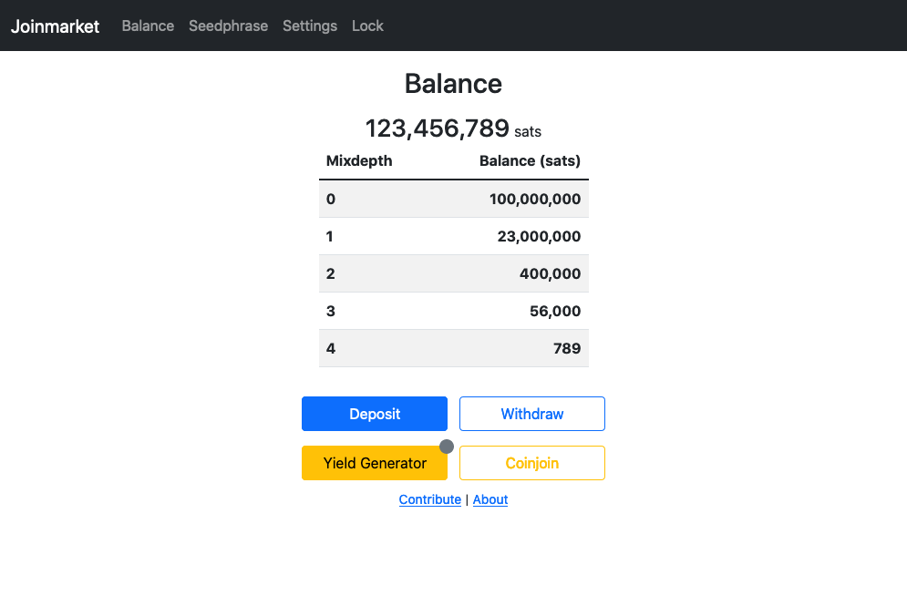

# GUI for Joinmarket

## Screenshots



## How to install

### Install Bitcoin core
- Install and run a Bitcoin core node ([bitcoincore.org](https://bitcoincore.org/en/download/))
- Configure Bitcoin RPC server

### Install JoinMarket or Joininbox
- [Joinmarket](https://github.com/JoinMarket-Org/joinmarket-clientserver)
- [JoininBox](https://github.com/openoms/joininbox)
- Configure SSL certificate
	- `mkdir ~/.joinmarket/ssl`
	- `openssl req -newkey rsa:4096 -x509 -sha256 -days 3650 -nodes -out ~/.joinmarket/ssl/cert.pem -keyout ~/.joinmarket/ssl/key.pem`
- Run wallet daemon: `python scripts/jmwalletd.py`

## Install Joinmarket-GUI (JMG)
- Install Python 3.6 or higher ([python.org](https://www.python.org/downloads/))
- Clone this repository or download the latest release and unpack
- Enter the directory: `cd joinmarket-gui`
- Create a virtual environment: `python3 -m venv jmg_venv`
- Activate the virtual environment: `source jmg_venv/bin/activate`
- Install the dependencies: `pip install -r requirements.txt`
- Set the environment variable to the IP address of JoinMarket wallet daemon: `export JM_WALLET_IP=<IP_ADDRESS>`
- Launch the application: `python src/app.py`

## Donate

BTC: [bc1qu3dskrp8v5x6t6vmsr56rnrutngan58np9wa75](https://blockstream.info/address/bc1qu3dskrp8v5x6t6vmsr56rnrutngan58np9wa75)

## Installation as Specter-Extension
```
virtualenv --python=python3 .env
. ./.env/bin/activate
pip3 install -r requirements.txt --pre
python3 -m cryptoadvance.specter server --config DevelopmentConfig --debug
# http://localhost:25441
# choose the joinmarket service (you might need to activate )
```