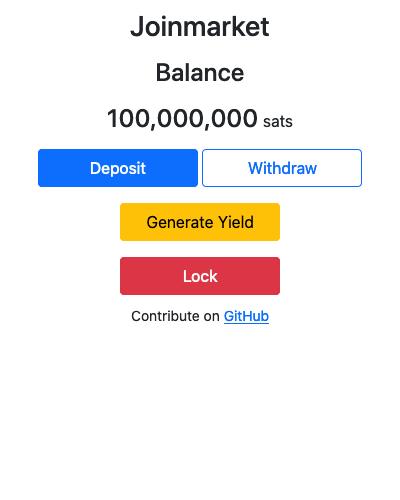
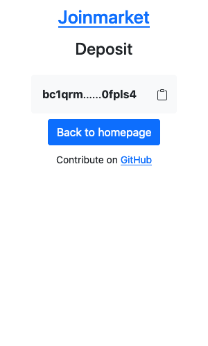
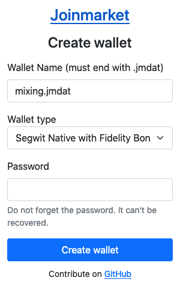
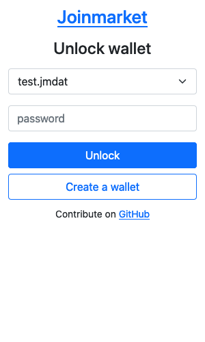
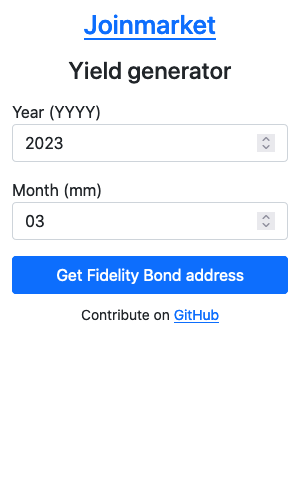
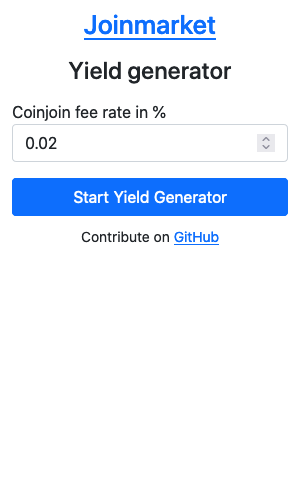

# GUI for Joinmarket

## Screenshots

## How to install

- Install Python 3.6 or higher
- `pip install Flask`
- `pip install requests`
- `cd src`
- (optional) change the IP of the joinmarket API if not running on the same computer in `src/app.py`
- `export FLASK_APP=app`
- `flask run`

## Donate

BTC: bc1qu3dskrp8v5x6t6vmsr56rnrutngan58np9wa75